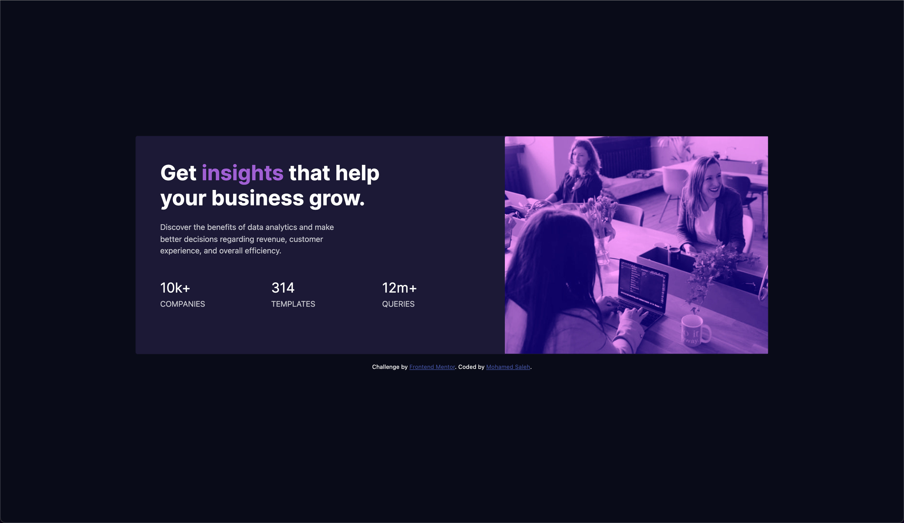

# Frontend Mentor - Stats preview card component solution

This is a solution to the [Stats preview card component challenge on Frontend Mentor](https://www.frontendmentor.io/challenges/stats-preview-card-component-8JqbgoU62). 

## Table of contents

- [Overview](#overview)
  - [The challenge](#the-challenge)
  - [Screenshot](#screenshot)
  - [Links](#links)
  - [Built with](#built-with)
  - [Continued development](#continued-development)
  
- [Author](#author)

## Overview

### The challenge

Users should be able to:

- View the optimal layout depending on their device's screen size

### Screenshot

### Links

- Solution URL: [https://www.frontendmentor.io/solutions/solution-built-with-html-css-and-bootstrap-UyTr5OfGG]
- Live Site URL: [https://mohamedsalehjr.github.io/Stats-preview-card-component/]

### Built with

- Semantic HTML5 markup
- CSS 
- Bootstrap

### Continued development

An area I would like to develop is the responsiveness depending on screen size. In particular the spacing of between text and the resizing of images.

## Author

- Website - [Mohamed Saleh](https://mohamedsalehdev.info/)
- Frontend Mentor - [@MohamedSalehjr](https://www.frontendmentor.io/profile/MohamedSalehjr)

